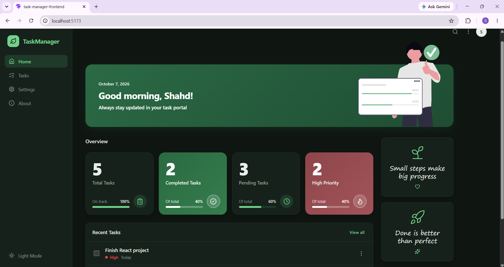

# TaskManager

A clean, simple task manager built with React and TypeScript. No backend, your tasks are saved in your browser.

**[Live demo](https://task-manager-shahd-ae89.vercel.app/)**



## Features

- Add, edit, delete and complete tasks
- Priority, due date, category and description
- Search, status tabs, and category / priority filters
- Light and dark mode
- Data saved with localStorage

## Built with

React · TypeScript · Vite · CSS

## Run locally

```bash
git clone https://github.com/YOUR-USERNAME/YOUR-REPO.git
cd YOUR-REPO
npm install
npm run dev
```

## Author

Made by Shahd
